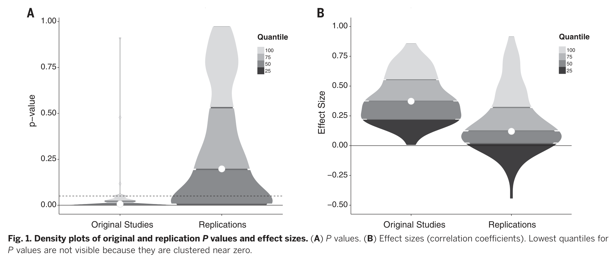
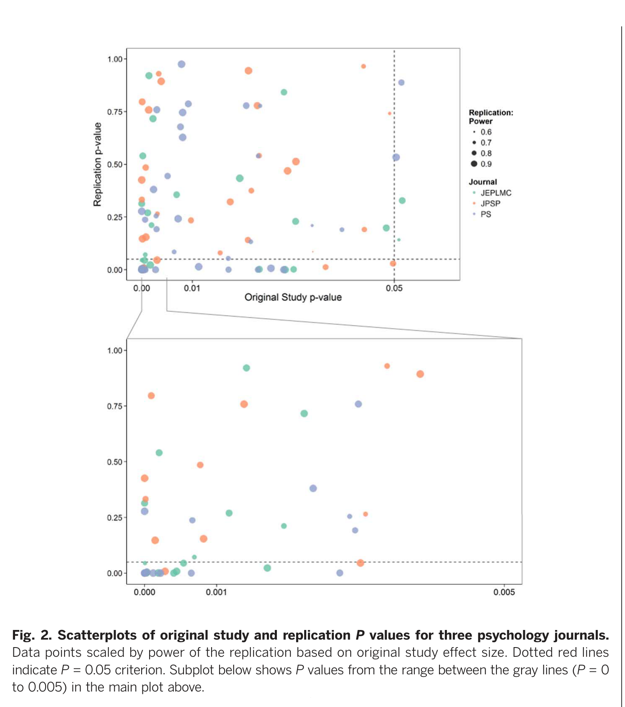
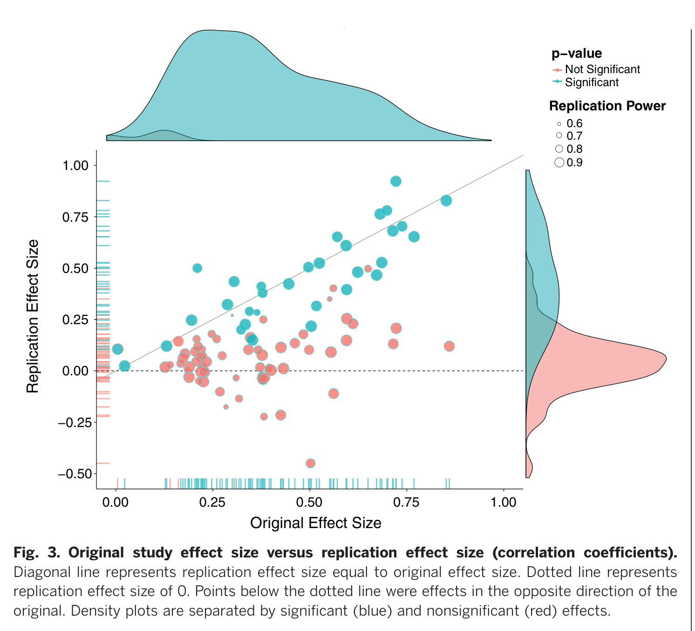

## Outline

<ol>
<li>Background — the replicability debate in psychology</li>
<li>Background — the Open Science Collaboration</li>
<li>Question and design</li>
<li>Methods — study selection, protocol, success criteria</li>
<li>Results — significance, effect sizes, scatterplots, moderators</li>
<li>Discussion — interpretation, critiques, implications</li>
<li>Questions for the room</li>
</ol>

# Background

## The replicability debate in psychology {.smaller}

- **Ioannidis (2005)** — "Why most published research findings are false": low power × selection × flexibility ⇒ many published claims are false.
- **Bem (2011, *JPSP*)** — nine experiments reporting evidence for precognition, published with conventional standards. A wake-up call for the field.
- **Simmons, Nelson & Simonsohn (2011)** — *False-positive psychology*: undisclosed researcher degrees of freedom inflate Type I error far above 5%.
- **Stapel (2011)** and other fraud cases sharpen attention on data integrity.
- **Failed direct replications** of high-profile findings (e.g. social priming: Doyen et al. 2012 on Bargh) accumulate.
- **Many Labs 1** (Klein et al. 2014) — first coordinated multi-site replication: some effects very robust, others not.

::: {.fragment}
By 2014–15, "reproducibility crisis" is a live, contested label. **What is the base rate of replication?**
:::

## The Open Science Collaboration {.smaller}

- Coordinated through the **Center for Open Science** (Brian Nosek, founded 2013, Charlottesville VA).
- **~270 contributing authors**, three years of work (2011–2015).
- Goal: one large, *pre-registered*, transparent estimate of replicability in psychology, with open data, materials, and code on **OSF** (osf.io).
- First project of its kind at this scale; template for later efforts:
  - **Many Labs 2/3/5**, Social Sciences Replication Project (SSRP, 2018),
  - **Reproducibility Project: Cancer Biology** (started 2013, results 2021).
- Output: the present paper + a public registry of 100 replication reports.

# Question and design

## What did they ask? {.smaller}

> *What proportion of published psychology findings can be reproduced by independent teams using high-powered direct replications and the original materials?*

- **Direct replication**: same methods, new sample. Not conceptual replication.
- Five operational indicators of "did it replicate" (next slide).
- Single point estimates are dangerous — they report **multiple complementary indicators** because no single number captures replication.

## Study selection {.smaller}

- **Source**: 2008 issues of three journals
  - *Psychological Science* (PSCI) — general
  - *Journal of Personality and Social Psychology* (JPSP) — social
  - *Journal of Experimental Psychology: Learning, Memory & Cognition* (JEP:LMC) — cognitive
- **Within-journal sampling**: articles ordered chronologically from the first 2008 issue forward; 488 articles in the frame, 158 (≈32%) became eligible. Replication teams self-matched to articles by expertise from the available pool; coordinators also recruited teams for specific articles. Final pool sizes: PSCI 68, JPSP 59, JEP:LMC 40.
- **Within-article sampling**: target the *last* reported effect — an objective rule, since first studies tend to be preliminary demonstrations.
- **Final set**: 100 replications completed.
- Each replication: pre-registered protocol, reviewed by original authors when possible, high statistical power (median ~92%).

## Five success criteria {.smaller}

| # | Indicator | Question it answers |
|---|---|---|
| 1 | Replication *p* < .05, same direction | Did the replication itself reject the null? |
| 2 | Original effect inside replication 95% CI | Is the original estimate compatible with the replication? |
| 3 | Replication effect size vs original | How much smaller (or larger) is the new estimate? |
| 4 | Meta-analytic combination of the two | What is the pooled evidence? |
| 5 | Subjective "did it replicate?" rating | Holistic judgement by the replicating team |

::: {.fragment}
**No single number is privileged**. This is a deliberate methodological stance.
:::

# Results

## Significance rates {.smaller}

- **97%** of original studies reported *p* < .05.
- **36%** of replications reached *p* < .05 in the same direction.
- **47%** of replication effects fell inside the original 95% CI.
- **39%** were subjectively judged to have replicated.
- Pooled (original + replication) meta-analysis: **68%** of combined intervals exclude zero — but this conflates original and new evidence.

::: {.fragment}
Whichever indicator you pick, the rate is **substantially below** what the published literature would suggest.
:::

## Fig. 1 — distributions of *p* values and effect sizes

{fig-alt="Density plots of original and replication p-values and effect sizes"}

::: {.notes}
Mean original effect size r ≈ 0.40; mean replication r ≈ 0.20. Roughly halved.
:::

## Fig. 2 — original vs replication *p* values

{fig-alt="Scatterplot of original vs replication p-values, by journal"}

::: aside
Point size scaled by replication power. Inset zooms on *p* < .005.
:::

## Fig. 3 — original vs replication effect sizes

{fig-alt="Scatterplot of original vs replication effect sizes, with marginal densities"}

## Moderators of replication success {.smaller}

Replication was more likely when:

- **Original *p* value smaller** — far more predictive than reaching .05.
- **Original effect size larger**.
- **Original study rated less "surprising"** by the replicating team.
- **Cognitive** > **social** psychology (≈50% vs ≈25% by the *p* < .05 criterion).
- Field, journal, and study characteristics matter; individual replication teams' effort did **not** predict outcomes much.

::: {.fragment}
Implication: *p* just under .05 is weaker evidence than the field treats it as.
:::

# Discussion

## How should we read this? {.smaller}

- **Non-replication ≠ falsification.** A single failed replication is just another single study.
- **Original effects are likely inflated** by publication selection and flexibility in analysis (winner's curse).
- **Replicability is necessary but not sufficient** for truth — a finding can be replicable and still wrong (e.g. confounded).
- The honest summary is *uncertainty*, not a verdict on any one finding.

## Critiques and the back-and-forth {.smaller}

- **Gilbert, King, Pettigrew & Wilson (2016, *Science*)** challenged the headline number, arguing
  - protocol *infidelities* (different populations, materials) lowered replication rates,
  - the 36% figure understates the "true" replicability,
  - sampling within journal issues was non-random.
- **OSC reply (Anderson et al. 2016)**: defended the design, noted that the critique itself relied on selective use of indicators and assumed perfect original-study fidelity.
- Broader point: **any single summary statistic is contestable**; the value of the project is the *open dataset*, not the headline.

## Implications for practice {.smaller}

- **Single studies are weak evidence**, even when *p* < .05.
- **Pre-registration**, **larger samples**, **open data and materials** should be defaults.
- **Direct replications** deserve publication and credit.
- **Cumulative evidence** (meta-analysis, registered replication reports) over hero studies.
- This paper helped catalyse: TOP guidelines, Registered Reports, mandatory data-sharing policies, and the broader Open Science movement.

# Questions for the room

## Discussion {.smaller .incremental}

1. How much of the gap is **publication bias** vs **questionable research practices** vs **genuine heterogeneity** across samples and contexts?
2. Are the same dynamics at work in **your** field? (statistics, biostatistics, oncology, …)
3. How would a **Bayesian** account of these data differ — prior plausibility, posterior probability of an effect?
4. Where does **direct replication** stop being informative and **theoretical reformulation** start?

## References {.smaller}

- Open Science Collaboration (2015). Estimating the reproducibility of psychological science. *Science* **349**: aac4716. doi:10.1126/science.aac4716
- Ioannidis JPA (2005). Why most published research findings are false. *PLoS Med* **2**: e124.
- Simmons JP, Nelson LD, Simonsohn U (2011). False-positive psychology. *Psychol Sci* **22**: 1359–66.
- Klein RA et al. (2014). Investigating variation in replicability: a "Many Labs" replication project. *Soc Psychol* **45**: 142–52.
- Gilbert DT, King G, Pettigrew S, Wilson TD (2016). Comment on "Estimating the reproducibility of psychological science." *Science* **351**: 1037.
- Anderson CJ et al. (2016). Response to Comment on … *Science* **351**: 1037.
- Gambarota, Fitelson, Parmigiani (2025). *The Three Rs of Trustworthy Science*. <https://filippogambarota.github.io/replicability-book/>

# Backup slides

## Ioannidis (2005) {.smaller}

*"Why most published research findings are false"* — *PLoS Medicine*.

- Treats research findings as a screening test. **Positive predictive value** depends on:
  - **Prior odds** R of a true relationship in the field
  - **Power** 1 − β of the study
  - **Bias** u (flexibility, selective reporting)
- PPV = (1 − β)R / (R + α − βR + u(1 − β + βR))
- With low prior odds (exploratory hypotheses) and low power (small N), **most "significant" findings are false**.
- Bias can be modelled and dominates as it grows; small studies with extreme flexibility have PPV near zero.
- Foundational reference for the field-level pessimism that the OSC project tests empirically.

## Bem (2011) — precognition in *JPSP* {.smaller}

*"Feeling the future"* — nine experiments, 1,000+ participants, claimed evidence that future events influence past responses.

- Used **standard JPSP-acceptable methods**: that is the point.
- **Wagenmakers, Wetzels, Borsboom & van der Maas (2011)** Bayesian re-analysis: same data, Bayes factors strongly favour the null.
- **Galak, LeBoeuf, Nelson & Simmons (2012)** ran direct replications across seven studies, N > 3,000: no effect.
- **Ritchie, Wiseman & French (2012)**: three further failed replications, initially rejected by *JPSP*.
- Crystallised the question: *if standard methods can deliver "evidence" for precognition, what else are they delivering?*

## Simmons, Nelson & Simonsohn (2011) {.smaller}

*"False-positive psychology"* — *Psychological Science*.

- Quantified **researcher degrees of freedom**: optional stopping, selective reporting of conditions/measures, covariate inclusion, transformations.
- A simulation and a real experiment showed Type-I error can reach **~60%** with four such choices undisclosed.
- Coined the **"garden of forking paths"** intuition (later formalised by Gelman & Loken 2013).
- **Six author requirements** + **four reviewer guidelines** — including: justify N a priori, list all conditions, report all variables, all exclusions.
- Direct intellectual ancestor of pre-registration and Registered Reports.

## Stapel (2011) — fraud {.smaller}

Diederik Stapel, social psychologist at Tilburg, suspended after PhD students raised the alarm.

- **~58 retractions** by 2015, including high-profile *Science* papers (e.g. on disorder priming racial stereotyping).
- **Levelt, Noort & Drenth Commission** (2012) report: years of outright data fabrication, undetected by co-authors, reviewers, editors.
- The point is **not** that fraud is the cause of the crisis — it is rare. Stapel made *fabrication* indistinguishable from *normal practice* until students checked. That diagnosis was the wake-up.
- Catalysed Dutch and broader policy on data archiving and verification.

## Doyen et al. (2012) — elderly priming {.smaller}

Direct replication of **Bargh, Chen & Burrows (1996)**: priming "elderly" stereotypes claimed to slow participants' walking speed leaving the lab.

- Doyen et al. ran two experiments (Brussels) with infrared timing instead of stopwatch.
- **No effect of prime on walking speed** when experimenters were blind to condition.
- Effect *appeared* when experimenters knew the condition — consistent with **experimenter expectancy**, not unconscious priming.
- John Bargh's combative blog response amplified the controversy and drew the wider community in.
- Part of a broader wave of failures for **social priming** effects (money priming, professor priming, etc.).

## Many Labs 1 — Klein et al. (2014) {.smaller}

First large coordinated replication: **36 sites**, **6,344 participants**, **13 classic effects**.

- Each site ran the same standardised protocol on its local sample.
- **10 of 13 effects replicated** in the expected direction; some very robustly (anchoring), others not at all (currency priming, flag priming).
- **Heterogeneity across sites was small** for most replicated effects: the variation people feared (culture, language) was less of a story than expected.
- Demonstrated feasibility of coordinated, pre-registered, multi-site replication — directly inspired OSC and later Many Labs 2/3/5.
