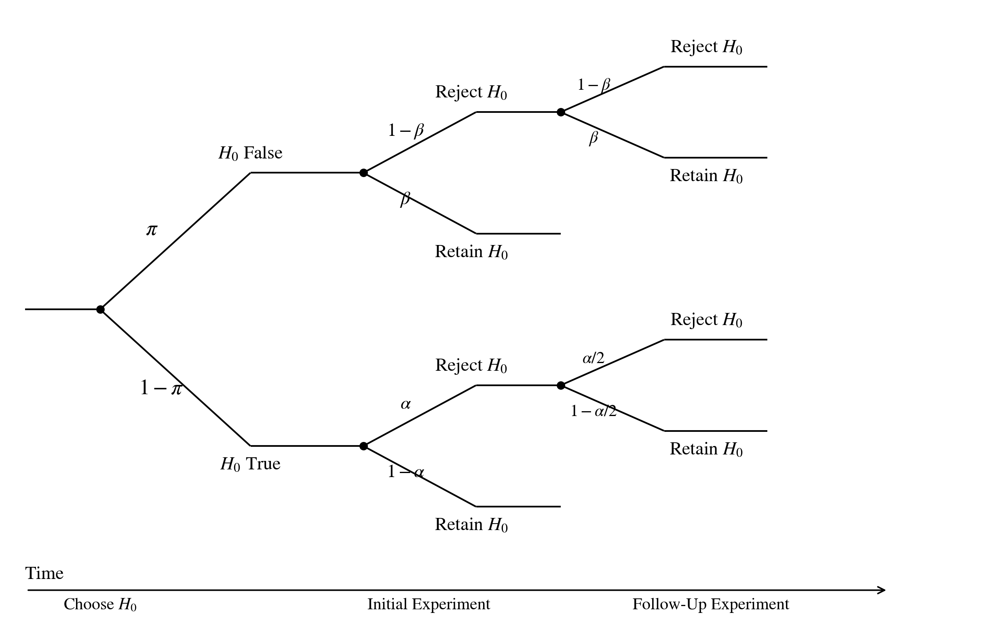
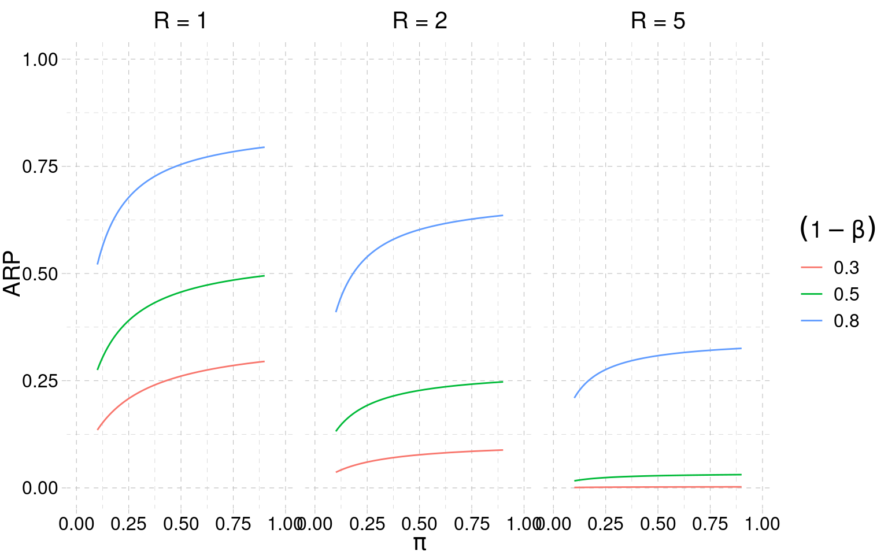
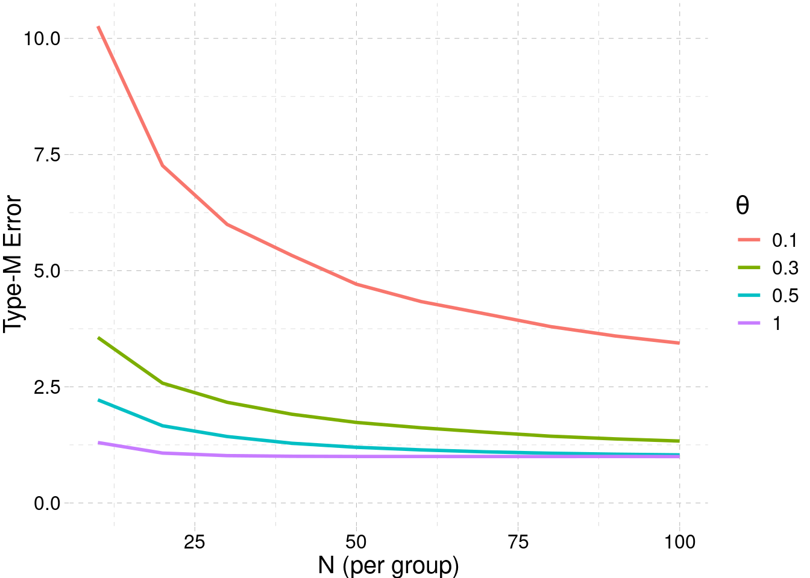

## Outline {.smaller}

<ol>
<li>Miller's two definitions: ARP and IRP</li>
<li>Notation and the two-level generative model</li>
<li>The simple-null special case — Miller's setting</li>
<li>Individual Replication Probability (general formula)</li>
<li>Aggregate Replication Probability (special case: same α and β)</li>
<li>Bayesian IRP</li>
<li>Selection and regression to the mean</li>
<li>Type-M error</li>
<li>Discussion</li>
</ol>

## Miller's two definitions {.smaller}

::: {.columns}
::: {.column width="50%"}
**Aggregate Replication Probability (ARP)**

Probability that researchers in a *field* find a significant replication, given a significant original.

A property of the **field**, summarised by π.
:::
::: {.column width="50%"}
**Individual Replication Probability (IRP)**

Probability of a significant replication of *this specific* original study.

A property of **one experiment**, conditional on its observed effect.
:::
:::

## Notation {.smaller}

- Studies indexed by $r$: $r=0$ original, $r=1,\dots,R$ replications.
- True effects: $\theta_0, \theta_1, \dots, \theta_R$ (scalar). Estimates $\hat\theta_r$.
- **Precise replication**: $\theta_0 = \theta_1 = \dots$. **Extension**: $\theta_r$ vary.
- Null hypothesis: $|\theta| < h_0$, the *region of practical equivalence* (ROPE).
- $\pi$ = proportion of non-null effects in the population of studies (= *strength* of a research area).
- *One-to-one* design: $R=1$. *One-to-many*: $R>1$.

## The two-level generative model {.smaller}

::: {.columns}
::: {.column width="55%"}
- Studies are *drawn from a hypothetical universe*.
- A fraction $\pi$ have non-null effects $\theta \sim N(\mu_\theta, \tau^2)$.
- A fraction $1-\pi$ are in the ROPE.
- $\tau \to 0$ in a precise replication ⇒ same $\theta$ for original and replication.
:::
::: {.column width="45%"}
{fig-alt="Two-level generative model with mu_theta and tau and proportion pi"}
:::
:::

## Simple null hypothesis — Miller's case {.smaller}

::: {.columns}
::: {.column width="55%"}
- Miller uses **point null**: $\theta = 0$ exactly with mass $1-\pi$, continuous component with mass $\pi$.
- This is the limit $h_0 \to 0$ of the ROPE.
- Is the historical default in psychology.
- Everything that follows (calculus, ARP, IRP) is in this regime.
:::
::: {.column width="45%"}
{fig-alt="Point-null version of the generative model with a spike at zero"}
:::
:::

## Sequence of events (after Miller 2009) {.smaller}

::: {.columns}
::: {.column width="55%"}
{fig-alt="Probability tree for the original/replication sequence"}
:::
::: {.column width="45%"}
- Each study tests one $H_0$. Prior: $\Pr(H_1)=\pi$, $\Pr(H_0)=1-\pi$.
- **Initial experiment** — if $H_0$ false, $\Pr(\text{reject})=1-\beta$; if $H_0$ true, $\Pr(\text{reject})=\alpha$.
- A **follow-up replication** runs only after a rejection.
- If $H_0$ false: replication rejects with the same power $1-\beta$ (precise replication).
- If $H_0$ true: replication rejects *in the same direction* with probability $\alpha/2$ (concordance assumption).
:::
:::

## Individual Replication Probability {.smaller}

Condition on original significance $|t_0|>t_{c_0}$. Replication success = $|t_1|>t_{c_1}$ **and** same sign:

$$
p_{\text{rep}} \;\approx\;
\frac{\Pr(H_1)\,(1-\beta_0)(1-\beta_1)\;+\;\bigl(1-\Pr(H_1)\bigr)\,\alpha_0\,\alpha_1/2}
     {\Pr(H_1)\,(1-\beta_0)\;+\;\bigl(1-\Pr(H_1)\bigr)\,\alpha_0}
$$

- **Numerator**: joint probability of both studies being significant and concordant.
- **Denominator**: probability the original was significant (publication conditions on this).
- The $\alpha/2$ accounts for half of false positives being in the opposite direction.

## IRP and PPV for $H_1$ after the original {.smaller}

Let $O$ denote the event "original was significant" ($|t_0|>t_{c_0}$).

**IRP** — probability of significant + concordant replication, given $O$:

$$
p_{\text{IRP}} \;\approx\;
\frac{\Pr(H_1)(1-\beta_0)(1-\beta_1) + \bigl(1-\Pr(H_1)\bigr)\alpha_0\alpha_1/2}
     {\Pr(H_1)(1-\beta_0) + \bigl(1-\Pr(H_1)\bigr)\alpha_0}.
$$

**PPV for $H_1$** — posterior probability the original is a true positive:

$$
\Pr(H_1 \mid O) \;=\;
\frac{\Pr(H_1)\,(1-\beta_0)}{\Pr(H_1)(1-\beta_0) + \Pr(H_0)\,\alpha_0}.
$$

Equivalently, in **odds** form (prior odds × Bayes factor):

$$
\frac{\Pr(H_1\mid O)}{\Pr(H_0\mid O)} \;=\;
\frac{\Pr(H_1)}{\Pr(H_0)} \cdot \frac{1-\beta_0}{\alpha_0}.
$$

IRP as a posterior-weighted average (PPV for $H_1$ on the first term, $1-\text{PPV}$ on the second):

$$
p_{\text{IRP}} \;=\; \Pr(H_1 \mid O)\,(1-\beta_1) \;+\; \Pr(H_0 \mid O)\,(\alpha_1/2).
$$

## Same power and significance {.smaller}

Specialise the master formula with:

- $\alpha_0 = \alpha_1 = \alpha$, $\beta_0 = \beta_1 = \beta$ (same design replicated),
- $\Pr(H_1) = \pi$ (random draw from the field),
- simple null.

$$
p_{\text{ARP}} \;\approx\;
\frac{\pi\,(1-\beta)^2 \;+\; (1-\pi)\,\alpha^2/2}
     {\pi\,(1-\beta) \;+\; (1-\pi)\,\alpha}.
$$

## The contingency-table view {.smaller}

|              | Reject $H_0$            | Retain $H_0$          |          |
|---           |---                      |---                    |---       |
| $H_0$ false  | True positive $(1-\beta)$ | False negative $\beta$  | $\pi$    |
| $H_0$ true   | False positive $\alpha$ | True negative $1-\alpha$ | $1-\pi$ |

- **Original significant** = TP + FP, weighted by π: $\pi(1-\beta) + (1-\pi)\alpha$ — the denominator.
- **Both significant and concordant** = TP-then-TP + (half of) FP-then-FP: the numerator.
- ARP is the ratio.

## ARP as a function of π, power, and R

{fig-alt="ARP as a function of pi for different power and R values"}

## What this plot tells us {.smaller}

- For **medium-strength** fields ($\pi$ around 0.3–0.5), ARP is **low** — even with high power.
- **Adding required replications ($R>1$) hammers ARP down** in every condition.
- The contrast with the "*p* < .05 means we found something" framing is the whole point.
- **Ulrich & Miller (2020)**: π is the dominant lever; explicit QRPs add modestly on top.

## Bayesian IRP {.smaller}

So far $\Pr(H_1) = \pi$ has been read as a **field frequency** — the proportion of non-null hypotheses tested in a research area.

A **Bayesian re-reading**: let $\Pr(H_1)$ be a **prior for *this* study**, encoding what was known *before* the original was run — theory, prior data, animal/biological evidence, plausibility.

- Apply the same IRP formula with this study-specific prior in place of $\pi$.
- Two limitations of plugging in $\hat\theta_0$ this way:
  1. **Sampling variability** in $\hat\theta_0$ is ignored.
  2. **Field-level information** about effect-size distributions is ignored.
- Both are addressed by **hierarchical Bayesian models** (Pawel & Held 2020): integrate over the posterior of $\theta$ and pool across studies, yielding a predictive distribution for the replication.

## Selection and regression to the mean {.smaller}

- Journals publish original studies **selected on significance** — $p \le \alpha$ is a filter on the raw evidence.
- For a given true $\theta$, only sampling realisations with $|\hat\theta|$ above a threshold survive the filter ⇒ the published $\hat\theta$ is **systematically larger** than $\theta$.
- A direct replication, **not** selected on significance, draws from the unfiltered sampling distribution and therefore **regresses toward $\theta$** — typically smaller, often non-significant.
- This is the mechanism behind OSC (2015) finding replication effects roughly **half** the original effect sizes.
- Quantified by the **Type-M error** (next slide).

## Type-M (magnitude) error {.smaller}

::: {.columns}
::: {.column width="55%"}
**Definition** (Gelman & Carlin 2014). The Type-M error is the *expected exaggeration factor* of a statistically significant estimate:

$$
\text{Type-M} \;=\; \frac{\mathbb{E}\!\left[\,|\hat\theta|\;\big|\;p \le \alpha\,\right]}{|\theta|}.
$$

**Mechanism.** Conditioning on $|\hat\theta| > c \cdot \text{SE}$ truncates the sampling distribution from below; the mean of the truncated tail can be much larger than $\theta$ when SE is large relative to $\theta$ (low power).

**Rule of thumb.** Type-M $\approx 1$ when power $\ge 0.8$, but Type-M $\gg 1$ as power drops.

Distinct from **Type-S** (sign) error and from Type-I/Type-II. Concerns *magnitude* given significance.
:::
::: {.column width="45%"}
{fig-alt="Type-M error increases as sample size and true effect size decrease"}

::: aside
Type-M vs sample size, for several true effect sizes.
:::
:::
:::

## Implications {.smaller}

- *p* < .05 ≠ replicability. Miller (2009) makes this **calculable**, not just plausible.
- Replication probability depends on **field strength (π)**, **power**, **researcher behaviour**, and the **inference made on the original** — not on the *p* value alone.
- Plan replications with **lower bounds** or a **predictive distribution**, not the point estimate.
- Selection + low power ⇒ inflated original effects ⇒ shrinkage in replication — the mechanism that OSC (2015) later measured directly.

## Questions for the room {.smaller}

1. In **your** field, what is your prior on π — the proportion of *tested* hypotheses that are non-null?
2. Miller's IRP assumes $\theta_{\text{true}} = \hat\theta_0$. How much would you discount this for a typical first publication in your area?
3. When can π be read as a **frequentist field strength** and when as a **Bayesian prior on this study**? When are they interchangeable, and when not?
4. For **one-to-many** replication designs, how do you decide $R$? What is your operating definition of "the effect replicated"?
5. Where do Miller's assumptions break first in your domain — precise replication, equal power, point null, no sampling variability in $\hat\theta_0$?

## References {.smaller}

- Miller J (2009). What is the probability of replicating a statistically significant effect? *Psychonomic Bulletin & Review* **16**: 617–640.
- Pawel S, Held L (2020). Probabilistic forecasting of replication studies. *PLoS ONE* **15**: e0231416.
- Ulrich R, Miller J (2020). Questionable research practices may have little effect on replicability. *eLife* **9**: e58237.
- Perugini M, Gallucci M, Costantini G (2014). Safeguard power as a protection against imprecise power estimates. *Perspect Psychol Sci* **9**: 319–32.
- Gelman A, Carlin J (2014). Beyond power calculations: assessing Type S and Type M errors. *Perspect Psychol Sci* **9**: 641–51.
- Open Science Collaboration (2015). Estimating the reproducibility of psychological science. *Science* **349**: aac4716.
- Gambarota F, Fitelson B, Parmigiani G (2025). *The Three Rs of Trustworthy Science*. <https://filippogambarota.github.io/replicability-book/>
